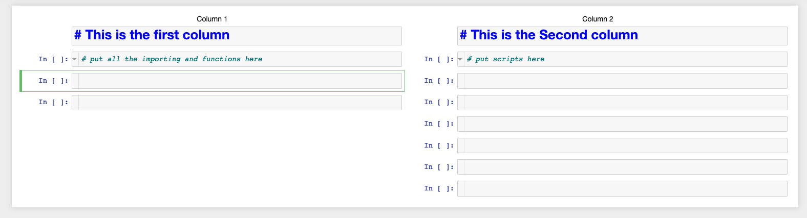

# Two-Column

a jupyter notebook extension to allow having two columns of cells side by side.

This is very early version.

## Todos

1. allow scroll seperatly for each column.

2. add keymapping for easy navigation.

3. add toggle button to switch back to normal version.

4. ...
